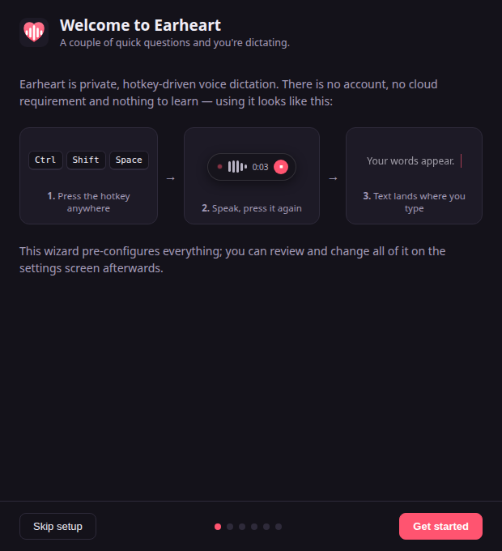
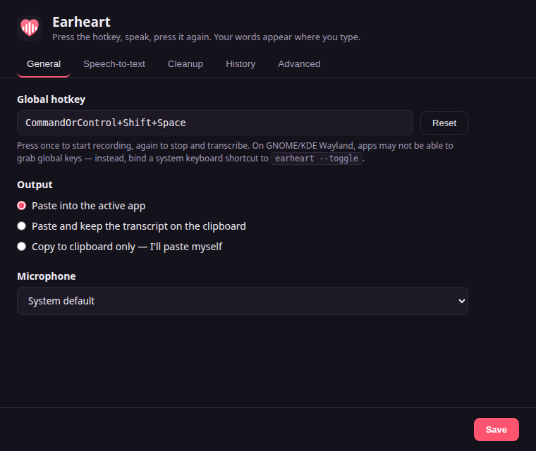

<p align="center">
  
</p>

<h1 align="center">Earheart</h1>

<p align="center">
  Private, hotkey-driven voice dictation for Windows, macOS and Linux.<br/>
  Press a key, speak, press again — your words appear where you type.
</p>

<p align="center">
  <br/>
  
</p>

---

Earheart records your voice when you press a global hotkey, transcribes it
with a speech-to-text service, optionally cleans the transcript up with a
language model, and then **pastes the result into whatever app you're typing
in** (or just copies it to your clipboard).

Out of the box both steps run **inside the app, on your computer** — no
separate program, no Python, no account. The setup wizard downloads a small
[Parakeet](https://huggingface.co/nvidia/parakeet-tdt-0.6b-v3) speech model and
a small [Gemma](https://huggingface.co/google) cleanup model (with a progress
bar) and runs them in-process. Nothing ever leaves your machine.

Prefer to point Earheart elsewhere? Both steps are also **modular,
OpenAI-compatible HTTP clients**, so you can choose where your voice goes:

- **Built-in (default)**: Parakeet + Gemma run in-process — fully private,
  nothing to install.
- **Local server**: run the [Parakeet STT server](stt-server/) and an
  [Ollama](https://ollama.com)/llama.cpp model yourself.
- **Mix and match**: local STT with a hosted LLM for cleanup, or any other
  combination. Switching is just a base URL in Settings.

## Features

- **Global hotkey** (default `Ctrl/Cmd+Shift+Space`): press to start, press to
  stop. A small overlay shows recording level and progress without stealing
  focus from the app you're dictating into.
- **Speech-to-text with NVIDIA Parakeet** — by default Parakeet TDT 0.6B v3
  (multilingual, 25 languages) runs **in-process** via sherpa-onnx / ONNX
  Runtime, faster than realtime on CPU and with no network hop. Or point
  Earheart at any OpenAI-compatible transcription API, or run the optional
  [`earheart-stt`](stt-server/) server yourself.
- **LLM cleanup (on by default)** — punctuation, filler-word removal, false
  starts. By default a small Gemma model runs **in-process**; or point cleanup
  at any OpenAI-compatible chat API. The prompt is fully editable. If cleanup
  fails, the raw transcript is delivered instead — your words are never lost.
- **Auto-paste, clipboard, or both** — paste straight into the focused app
  (with clipboard restore), paste *and* keep the transcript on the clipboard,
  or clipboard-only if you prefer to paste yourself.
- **Local history** — recent transcriptions are kept in a local JSON file so a
  mis-aimed paste never loses a dictation. Can be disabled.
- **No telemetry, no accounts, no cloud requirement.**

## Install

### Download a release

Grab the latest installer for your platform from the
[releases page](https://github.com/cleanunicorn/earheart/releases/latest):

| Platform | File | Install |
| --- | --- | --- |
| Windows | `Earheart Setup <version>.exe` | Run the installer (a portable `Earheart <version>.exe` is also available) |
| macOS | `Earheart-<version>.dmg` | Open and drag Earheart to Applications |
| Linux (any distro) | `Earheart-<version>.AppImage` | `chmod +x` the file, then run it |
| Debian / Ubuntu | `earheart_<version>_amd64.deb` | `sudo apt install ./earheart_<version>_amd64.deb` |

> **macOS note:** builds are not yet notarized, so the first launch may be
> blocked by Gatekeeper. Right-click the app → **Open**, or allow it under
> **System Settings → Privacy & Security → Open Anyway**.

That's it — the built-in engines need nothing else installed. The first-run
wizard downloads the speech and cleanup models for you.

### Advanced: a local STT server with `uv`

If you'd rather run the [Parakeet STT server](stt-server/) as a separate
process (e.g. to share it with other tools or use a GPU), start it yourself and
point Earheart's speech-to-text at its URL (default `http://127.0.0.1:8484/v1`)
in the setup wizard or Settings. Running it needs
[uv](https://docs.astral.sh/uv/getting-started/installation/) installed:

```bash
curl -LsSf https://astral.sh/uv/install.sh | sh   # Linux / macOS
winget install astral-sh.uv                       # Windows
cd stt-server && uv run earheart-stt              # start the server
```

Or point Earheart at a hosted transcription service (OpenAI, Groq, …) — the
setup wizard and Settings let you enter its URL and API key instead.

> **Upgrading from 0.4.x?** The in-process engines are new defaults; your
> existing configured STT/cleanup endpoints are preserved and keep working
> (migrated to the "remote" engine). The old "start a local STT server
> automatically" option has been removed — run the server yourself as above.

### Build from source

If there's no release for your platform:

```bash
git clone https://github.com/cleanunicorn/earheart
cd earheart
npm install
npm run dist     # installers for the current platform land in dist/
```

(Or run it unpackaged with `npm start`.)

## First run

<p align="center">
  
</p>

On first launch a short setup wizard walks through hotkey, microphone,
speech-to-text, cleanup and output. The defaults give you fully local, private
dictation that runs **inside the app**: keep "On this computer, built in" for
both speech-to-text and cleanup.

The wizard's last step downloads the models that run on your machine — a small
Parakeet speech model (≈ 660 MB) and a small Gemma cleanup model (≈ 700 MB) —
showing a progress bar as it goes. It's a one-time download; everything after
that is faster than realtime, even on CPU. You can pick a larger, higher-
quality cleanup model in the wizard or later in Settings → Cleanup.

### Transcript cleanup

Cleanup is **on by default** and runs the built-in Gemma model in-process: a
language model fixes punctuation and removes filler words and false starts,
with no network hop. You can disable it, pick a larger built-in model, or edit
the prompt in Settings → Cleanup.

Prefer to run cleanup elsewhere? Any OpenAI-compatible chat endpoint works. A
fully local example with [Ollama](https://ollama.com):

```bash
ollama pull llama3.1:8b
```

Then in the wizard (or Settings → Cleanup): base URL
`http://127.0.0.1:11434/v1`, model `llama3.1:8b`. For a hosted service
instead, use its base URL, API key and model name (e.g. OpenRouter, Groq,
OpenAI).

## Using Earheart

1. Put your cursor wherever you want text — an email, an editor, a chat box.
2. Press the hotkey (default `Ctrl/Cmd+Shift+Space`). A small pill appears at
   the bottom of the screen showing your mic level; it never steals focus.
3. Speak, then press the hotkey again. Earheart transcribes, optionally cleans
   up, and pastes the result right where you were typing.

Earheart lives in your system tray. From the tray menu you can start a
dictation, open the transcription history, or change any choice you made in
the wizard:

<p align="center">
  
</p>

A mis-aimed paste never loses your words: the History tab keeps recent
transcriptions in a local file (you can turn this off).

## Using other services

Anything that implements the OpenAI API shapes works out of the box:

| Component | Endpoint used | Examples |
| --- | --- | --- |
| Speech-to-text | `{base URL}/audio/transcriptions` | `earheart-stt` (local Parakeet), [speaches](https://github.com/speaches-ai/speaches), Groq (`https://api.groq.com/openai/v1`), OpenAI (`https://api.openai.com/v1`) |
| Cleanup | `{base URL}/chat/completions` | Ollama, llama.cpp server, LM Studio, vLLM, OpenRouter, OpenAI, … |

The reverse is also true: `earheart-stt` is a standalone OpenAI-compatible
transcription server, usable from any other dictation app that supports custom
endpoints (e.g. OpenWhispr) or from scripts via the OpenAI SDK. See
[stt-server/README.md](stt-server/README.md) for GPU use and other models.

## Platform notes

### Linux

- **Auto-paste** needs a keystroke tool: `xdotool` (X11) or `wtype`/`ydotool`
  (Wayland). Without one, Earheart falls back to clipboard-only and tells you.

  ```bash
  sudo apt install xdotool        # X11
  sudo apt install wtype          # wlroots Wayland (Sway, Hyprland, …)
  ```

- **Global hotkeys on Wayland**: GNOME and KDE on Wayland prevent apps from
  grabbing global keys. Instead, bind a system keyboard shortcut (GNOME
  Settings → Keyboard → Custom Shortcuts) to:

  ```bash
  earheart --toggle
  ```

  Earheart runs single-instance; a second invocation just toggles dictation in
  the running app.

### macOS

- The first dictation asks for **Microphone** permission.
- Auto-paste simulates Cmd+V via System Events, which requires
  **Accessibility** permission (System Settings → Privacy & Security →
  Accessibility → enable Earheart).

### Windows

- No special permissions needed. Auto-paste uses PowerShell `SendKeys`.

## Privacy

- With the built-in engines (the default), audio and transcripts never leave
  the app process — there is no network hop and no localhost socket.
- If you point speech-to-text at an HTTP service instead, audio is held in
  memory and sent only to the STT endpoint **you** configure (e.g. `127.0.0.1`
  for the optional local Parakeet server).
- Transcripts go to an external cleanup endpoint only if you switch cleanup to
  a remote service; the default Gemma cleanup stays on your machine.
- History and settings live in plain local files (Electron's user data
  directory). API keys are stored in that settings file — on shared machines,
  prefer local services or OS-level disk encryption.
- No telemetry, no accounts, no cloud.

## Contributing

Want to hack on Earheart? It's plain JavaScript with no bundler and only two
runtime dependencies (the native STT and cleanup engines). See
[CONTRIBUTING.md](CONTRIBUTING.md) for the development setup, architecture
overview, and how to build installers.

## License

[MIT](LICENSE)
