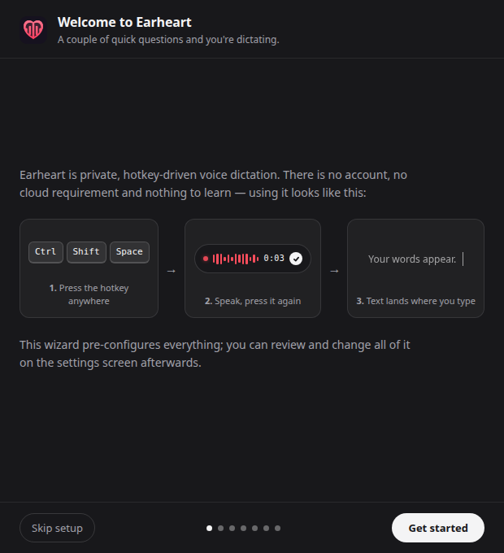
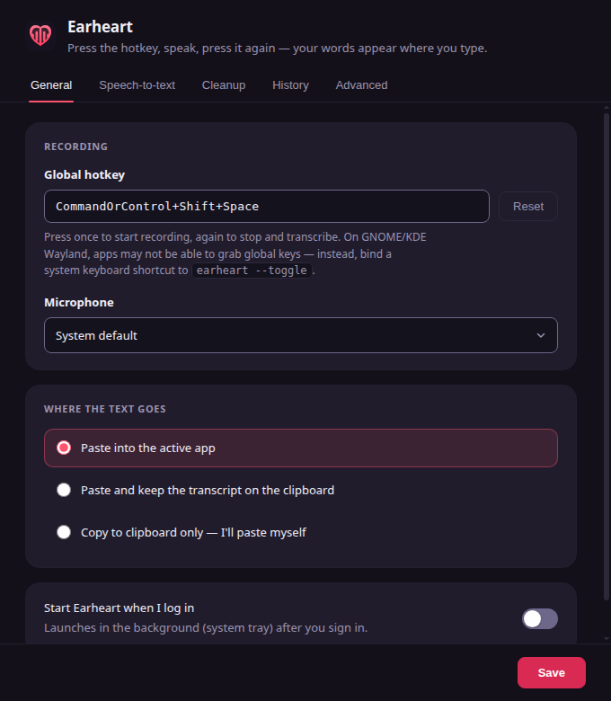

<p align="center">
  
</p>

<h1 align="center">Earheart</h1>

<p align="center">
  <b>Talk to your coding agents.</b><br/>
  Press a hotkey, speak your prompt, press again — it lands in Claude Code,
  Codex, Cursor, or whatever else has focus.<br/>
  Fully local. No cloud, no account, nothing leaves your machine.
</p>

<p align="center">
  <br/>
  <br/>
  
</p>

<p align="center">
  <sub>The overlay transcribes live as you speak, shows progress while it finishes up, then confirms where the text landed — without stealing focus.</sub>
</p>

---

Working with an agent is a conversation, but you type it like a form. The
prompts that actually work are long — context, constraints, the three things
you already tried, the "no, not like that." Typing all of that is the slow part
of the loop, and the reason people send a one-liner instead and then spend four
turns correcting it.

Earheart turns that part into talking. Press a global hotkey, say what you
want, press it again: your speech is transcribed on-device (NVIDIA Parakeet),
tidied up on-device (a small Gemma model drops the *ums*, false starts and
backtracking), and **pasted straight into whatever app has focus** — the
terminal running Claude Code, the Codex composer, Cursor's chat box, a GitHub
issue, an email.

**Nothing leaves your machine**, which matters more for agent prompts than for
ordinary dictation: what you say to an agent is your own code, your file
layout, your architecture, your unshipped work. Out of the box both models run
**inside the app, on your computer** — no separate program, no Python, no
account, no telemetry. The setup wizard downloads a small
[Parakeet](https://huggingface.co/nvidia/parakeet-tdt-0.6b-v3) speech model and
a small [Gemma](https://huggingface.co/google) cleanup model (with a progress
bar) and runs them in-process.

It is still a general-purpose dictation app: the same hotkey works in email,
notes, issues, and any other focused text field.

Prefer to point Earheart elsewhere? Both steps are also **modular,
OpenAI-compatible HTTP clients**, so you can choose where your voice goes:

- **Built-in (default)**: Parakeet + Gemma run in-process — fully private,
  nothing to install.
- **Local server**: run the [Parakeet STT server](stt-server/) and an
  [Ollama](https://ollama.com)/llama.cpp model yourself.
- **Mix and match**: local STT with a hosted LLM for cleanup, or any other
  combination. Switching is just a base URL in Settings.

## Talking to agents

Earheart works with any agent you can type into — no integration, plugin, API
key, or account required. It pastes into the focused window and leaves the
prompt for you to review and submit.

### Quick start for agents

1. [Install Earheart](#install) and finish the first-run wizard.
2. Put the cursor in your agent's input — a terminal, editor chat, desktop app,
   or browser composer.
3. Press `Ctrl/Cmd+Shift+Space`, speak the full prompt, then press the hotkey
   again.
4. Review the pasted prompt and press Enter yourself.

Per-tool setup recipes — terminal newlines, Wayland hotkeys, and hotkeys that
do not collide with your editor — live in **[docs/agents.md](docs/agents.md)**.

| Where you're prompting | What to know |
| --- | --- |
| **Claude Code / Codex CLI** (terminal) | Paste lands in the TUI input like any paste. On Linux, auto-paste needs `xdotool`/`wtype` — see [Platform notes](#linux). |
| **Cursor, VS Code, JetBrains chat** | Nothing special — click the chat box and dictate. |
| **claude.ai, ChatGPT, agent web UIs** | Same. The overlay never steals focus, so the composer keeps it. |
| **Anywhere via a shortcut** | Bind a system shortcut, mouse button or foot pedal to `earheart --toggle` instead of using the built-in hotkey. |

Three settings are worth a minute for agent work:

- **Cleanup style** (Settings → Cleanup). **Clean** — the default — removes
  *ums* and restarts but keeps your wording and intent. Switch to **Verbatim**
  for exact strings, commands, or code. Avoid **Polished** for prompts; smoothing
  prose is not what you want done to an instruction.
- **Dictionary** (Settings → Cleanup). Add the repo, service, tool, and teammate
  names you say every day — `pnpm`, `kubectl`, `PostgreSQL`, `useEffect` — so
  near-misses are corrected to the exact spelling.
- **Cleanup prompt** (Settings → Cleanup). Tell it to preserve file paths,
  flags, and identifiers exactly as spoken and never to answer the transcript.
  The default prompt already treats your dictation as text to clean, never as
  instructions to follow.

  The selected style's rules are added to your edited prompt, and Clean and
  Polished strip any filler or repeated word the model leaves behind. **Custom
  values** (the sampling tab) is the exception: it runs your prompt alone, with
  no style rules or safety net, so it must request filler and repetition removal.

**What it doesn't do yet.** You still press Enter yourself — Earheart pastes,
it does not submit. The agent cannot ask you a question by voice or talk back.
Those ideas are filed under the
[`agents`](https://github.com/cleanunicorn/earheart/issues?q=is%3Aissue+label%3Aagents)
label, and opinions are welcome.

## Features

- **Live transcript while you speak (on by default)** — with the built-in
  engine the overlay fills in the text as you talk, with a cleaned-up version
  settling in behind the raw words on pauses. The final transcript on stop is
  unchanged. Without stealing focus, the overlay draws your voice and tracks
  the finishing passes: transcription progress is estimated from your machine's
  measured decode speed and deliberately stops short of the end; cleanup follows
  actual generation. Toggle live transcription under Settings → Speech-to-text.
- **Cleanup built for spoken prompts** — the default **Clean** style fixes
  punctuation and removes filler words and false starts without polishing away
  your intent. Choose **Verbatim** or **Polished** with the style slider and edit
  the prompt underneath. Gemma runs in-process by default; any OpenAI-compatible
  chat API also works. If cleanup fails, Earheart delivers the raw transcript.
- **A dictionary for technical names** — teach Earheart the exact spelling of
  repo and product names, `pnpm`, `kubectl`, `useEffect`, or colleagues' names.
- **Pause and resume mid-dictation** — hold a take while you talk to someone or
  take a call, then resume it. Paused time is never captured or counted against
  the maximum length. You can also bind a global pause hotkey in Settings →
  General.
- **Private by default** — speech and cleanup run in-process, with no account,
  telemetry, cloud requirement, or network hop.
- **Works anywhere without an integration** — the global hotkey (default
  `Ctrl/Cmd+Shift+Space`) starts and stops dictation without moving focus. Bind
  `earheart --toggle` to a system shortcut, mouse button, or foot pedal; use
  `earheart --pause` for pause/resume.
- **Speech-to-text with NVIDIA Parakeet** — Parakeet TDT 0.6B v3 (multilingual,
  25 languages) runs in-process via sherpa-onnx / ONNX Runtime, faster than
  realtime on CPU. Or use any OpenAI-compatible transcription API or the
  optional [`earheart-stt`](stt-server/) server.
- **Auto-paste, clipboard, or both** — paste straight into the focused app
  (with clipboard restore), paste *and* keep the transcript on the clipboard,
  or clipboard-only if you prefer to paste yourself.
- **Local history** — recent transcriptions stay in a local JSON file, so a
  mis-aimed paste never loses a dictation. History can be disabled.
- **Start on login (optional)** — have Earheart launch into the tray
  automatically when you sign in, so the hotkey is always ready. Off by
  default; toggle it under Settings → General. Works on Windows, macOS and
  Linux.

## Install

### 1. Download the right file for your OS

Open the **[latest release page](https://github.com/cleanunicorn/earheart/releases/latest)**
and choose an asset (`<version>` is the version number, such as `0.8.0`):

| System | Download |
| --- | --- |
| 🪟 Windows | `Earheart-Setup-<version>.exe` for the installer, or `Earheart-<version>.exe` to run a portable build. Windows on ARM (Snapdragon X) uses these x64 builds under built-in emulation; both engines work, but there is no separate ARM build yet. |
| 🍎 macOS | `Earheart-<version>-arm64.dmg` for Apple Silicon (M1/M2/M3/M4), or `Earheart-<version>.dmg` for Intel. Each is packaged and tested on its matching architecture, which the updater preserves. Check  → **About This Mac** for “Chip” or “Processor” if unsure. |
| 🐧 Linux | `Earheart-<version>.AppImage` for any distro, or `earheart_<version>_amd64.deb` for Debian/Ubuntu. |

### 2. Install it

| Your download | What to do |
| --- | --- |
| `Earheart-Setup-<version>.exe` | Double-click and follow the installer. |
| `Earheart-<version>.exe` (portable) | Just double-click to run — no install. |
| `Earheart-<version>*.dmg` | Open it, then drag **Earheart** into **Applications**. (See the macOS note below — the first launch needs one extra step.) |
| `Earheart-<version>.AppImage` | In a terminal: `chmod +x Earheart-*.AppImage`, then double-click or run it. |
| `earheart_<version>_amd64.deb` | `sudo apt install ./earheart_<version>_amd64.deb` |

> **⚠️ macOS first launch: "Apple could not verify Earheart is free of malware"**
>
> Releases are signed, but not notarized by Apple, so the first launch needs
> one approval. Open Earheart, dismiss that dialog, then go to **System
> Settings → Privacy & Security**, scroll to the bottom, and click **Open
> Anyway** next to the Earheart message. The app opens from then on.
>
> You only ever do this once. Updates installed from inside the app relaunch
> without asking again.

That's it — the built-in engines need nothing else installed. The first-run
wizard downloads the speech and cleanup models for you.

### Updates

Earheart checks GitHub releases for a new version on startup and twice a day
(toggle under Settings → Advanced → Updates) and shows a notification plus an
**Update to vX.Y.Z** entry in the tray menu when one is out. It tells you what
you'd be getting: the prompt on the dictation bar lists the top changes (every
version between yours and the new one — Settings → Advanced shows the full
list), and after it updates itself the bar says what changed. One click
downloads the release, verifies its checksum and reinstalls in place:

- **Windows (installed):** the new installer runs silently and the app
  relaunches. The portable exe can't update itself — the app opens the
  releases page instead.
- **macOS:** the app bundle is swapped and the quarantine attribute is
  stripped automatically, so the updated app opens without going through
  Privacy & Security again.
- **Linux (AppImage):** the AppImage file is replaced in place (same path, so
  launchers and autostart keep working) and the app relaunches. A `.deb`
  install opens the releases page instead (upgrading needs `sudo`).

### Advanced: a local STT server with `uv`

If you'd rather run the [Parakeet STT server](stt-server/) as a separate
process (e.g. to share it with other tools or use a GPU), start it yourself and
point Earheart's speech-to-text at its URL (default `http://127.0.0.1:8484/v1`)
in Settings → Speech-to-text. Running it needs
[uv](https://docs.astral.sh/uv/getting-started/installation/) installed:

```bash
curl -LsSf https://astral.sh/uv/install.sh | sh   # Linux / macOS
winget install astral-sh.uv                       # Windows
cd stt-server && uv run earheart-stt              # start the server
```

Or point Earheart at a hosted transcription service (OpenAI, Groq, …) —
Settings → Speech-to-text lets you enter its URL and API key instead.

> **Upgrading from 0.4.x?** The in-process engines are new defaults; your
> existing configured STT/cleanup endpoints are preserved and keep working
> (migrated to the "remote" engine). The old "start a local STT server
> automatically" option has been removed — run the server yourself as above.

### Build from source

If there's no release for your platform (requires Node 22+):

```bash
git clone https://github.com/cleanunicorn/earheart
cd earheart
npm install
npm run dist     # installers for the current platform land in dist/
```

(Or run it unpackaged with `npm start`.)

## First run

<p align="center">
  
</p>

On first launch a short setup wizard walks through hotkey, microphone,
speech-to-text, cleanup and output. It sets up the **on-device engines** for
both speech-to-text and cleanup, so first-run dictation is fully local and
private with nothing to configure. Prefer a remote service? Switch any time in
Settings → Speech-to-text or Settings → Cleanup.

The wizard's last step downloads the models that run on your machine — a small
Parakeet speech model (≈ 670 MB) and a small Gemma cleanup model (≈ 800 MB) —
showing a progress bar as it goes. It's a one-time download; everything after
that is faster than realtime, even on CPU. If a download is interrupted,
retrying resumes from the saved partial file when possible. You can pick a
larger, higher-quality cleanup model in the wizard or later in Settings → Cleanup.

Every launch after that goes straight to the tray — no window to dismiss — and
posts a short "ready, press *your hotkey*" notification. Click it to open
Settings, or ignore it and start dictating. Settings is always in the tray menu.

### Transcript cleanup

Cleanup is **on by default** and runs the built-in Gemma model in-process: a
language model fixes punctuation and removes filler words and false starts,
with no network hop. You can disable it, pick a larger built-in model, or edit
the prompt in Settings → Cleanup.

Prefer to run cleanup elsewhere? Any OpenAI-compatible chat endpoint works. A
fully local example with [Ollama](https://ollama.com):

```bash
ollama pull llama3.1:8b
```

Then in Settings → Cleanup: base URL
`http://127.0.0.1:11434/v1`, model `llama3.1:8b`. For a hosted service
instead, use its base URL, API key and model name (e.g. OpenRouter, Groq,
OpenAI).

## Using Earheart

1. Put your cursor wherever you want text — an email, an editor, a chat box.
2. Press the hotkey (default `Ctrl/Cmd+Shift+Space`). A slim bar appears at
   the bottom of the screen — a status dot and word, your voice drawn live,
   and a timer; it never steals focus.
3. Speak, then press the hotkey again (or the bar's ✓ key). Earheart
   transcribes, optionally cleans up, and pastes the result right where you
   were typing. The ✕ key discards the dictation — nothing is typed.

Earheart lives in your system tray. From the tray menu you can start a
dictation, open the transcription history, or change any choice you made in
the wizard:

<p align="center">
  
</p>

A mis-aimed paste never loses your words: the History section in Settings
keeps recent transcriptions in a local file (you can turn this off).

## Using other services

Anything that implements the OpenAI API shapes works out of the box:

| Component | Endpoint used | Examples |
| --- | --- | --- |
| Speech-to-text | `{base URL}/audio/transcriptions` | `earheart-stt` (local Parakeet), [speaches](https://github.com/speaches-ai/speaches), Groq (`https://api.groq.com/openai/v1`), OpenAI (`https://api.openai.com/v1`) |
| Cleanup | `{base URL}/chat/completions` | Ollama, llama.cpp server, LM Studio, vLLM, OpenRouter, OpenAI, … |

The reverse is also true: `earheart-stt` is a standalone OpenAI-compatible
transcription server, usable from any other dictation app that supports custom
endpoints (e.g. OpenWhispr) or from scripts via the OpenAI SDK. See
[stt-server/README.md](stt-server/README.md) for GPU use and other models.

## Platform notes

### Linux

- **Auto-paste** needs a keystroke tool: `xdotool` (X11) or `wtype`/`ydotool`
  (Wayland). Without one, Earheart falls back to clipboard-only and tells you.

  ```bash
  sudo apt install xdotool        # X11
  sudo apt install wtype          # wlroots Wayland (Sway, Hyprland, …)
  ```

- **Global hotkeys on Wayland**: GNOME and KDE on Wayland prevent apps from
  grabbing global keys. Instead, bind a system keyboard shortcut (GNOME
  Settings → Keyboard → Custom Shortcuts) to:

  ```bash
  earheart --toggle
  ```

  Earheart runs single-instance; a second invocation just toggles dictation in
  the running app. The same works for pause/resume with `earheart --pause`.

### macOS

- **"Apple could not verify Earheart is free of malware"** on first launch is
  Gatekeeper: releases are signed with Earheart's own certificate but not
  notarized by Apple. Drag the app to Applications, launch it, dismiss the
  dialog, then approve it once under **System Settings → Privacy & Security →
  Open Anyway** (bottom of the pane). On macOS 15 right-click → **Open** no
  longer offers a bypass; Open Anyway is the way. If you would rather do it in
  a terminal:

  ```bash
  xattr -dr com.apple.quarantine /Applications/Earheart.app
  ```

- The first dictation asks for **Microphone** permission.
- Auto-paste simulates Cmd+V via System Events, which requires two
  permissions: **Accessibility** (System Settings → Privacy & Security →
  Accessibility → enable Earheart) and **Automation** (allow Earheart to
  control System Events when macOS asks on the first paste; later under
  Privacy & Security → Automation → Earheart → System Events). Releases are
  signed with the same certificate every time, so both permissions carry over
  across updates. Updating from an older unsigned release (v0.31.x or
  earlier) asks once more, and Earheart re-asks by itself on that first
  launch. If auto-paste stops working, use Settings → Advanced → **Fix
  auto-paste permission**: it clears a stale entry, re-asks, and opens the pane
  for whichever permission is off. If Earheart is still listed as on under
  Accessibility, remove it with **−** and add it again.
  When a paste fails the overlay and a notification say why, and the reason
  is also written to `~/Library/Logs/Earheart/earheart.log`.

### Windows

- No special permissions needed. Auto-paste uses PowerShell `SendKeys`.

## Privacy

- With the built-in engines (the default), audio and transcripts never leave
  the app process — there is no network hop and no localhost socket.
- If you point speech-to-text at an HTTP service instead, audio is held in
  memory and sent only to the STT endpoint **you** configure (e.g. `127.0.0.1`
  for the optional local Parakeet server).
- Transcripts go to an external cleanup endpoint only if you switch cleanup to
  a remote service; the default Gemma cleanup stays on your machine.
- History and settings live in plain local files (Electron's user data
  directory). API keys are stored in that settings file — on shared machines,
  prefer local services or OS-level disk encryption.
- No telemetry, no accounts, no cloud.

## Star history

<!--
  These SVGs are generated by the "Star history" GitHub Action and live on the
  orphan `star-history` branch. They only appear once that workflow has run
  successfully (see .github/workflows/star-history.yml for the one-time PAT
  setup). Until then the images 404, which is expected.
-->
<a href="https://github.com/cleanunicorn/earheart/stargazers">
  <picture>
    <source media="(prefers-color-scheme: dark)" srcset="https://raw.githubusercontent.com/cleanunicorn/earheart/star-history/assets/my-star-history/star-history-dark.svg" />
    
  </picture>
</a>

## Contributing

Want to hack on Earheart? It's plain JavaScript with no bundler and only two
runtime dependencies (the native STT and cleanup engines). See
[CONTRIBUTING.md](CONTRIBUTING.md) for the development setup, architecture
overview, and how to build installers.

## License

[MIT](LICENSE)
