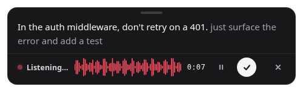

# Talking to agents: setup recipes

Earheart pastes into whatever window has focus, so every agent works without an
integration. This page is the 60-second setup per tool — the handful of things
that are actually specific to each one.

New here? Start with the [README](../README.md); this page assumes Earheart is
installed and the setup wizard is done.

<p align="center">
  
</p>

## Why dictate to an agent

A prompt that works is long: the context, the constraint, the two things you
already tried, the "no, not like that". Typing that is the slow part of the
loop, so most people send a one-liner and spend four turns correcting it.
Speaking it costs nothing extra — you say the whole thing because saying it is
free.

The privacy angle is sharper here than for ordinary dictation. An agent prompt
*is* your proprietary context: file paths, service names, architecture,
unshipped work. Out of the box both models run on your machine (Parakeet for
speech, Gemma for cleanup) — no network hop, no account, no telemetry. Nothing
you say to an agent leaves your computer unless you deliberately point Earheart
at a hosted endpoint.

## Do this once, for any agent

Settings → Cleanup, three fields, and every recipe below gets better:

1. **Cleanup style → Clean.** The default, and the right one for prompts: it
   drops the *ums* and false starts but keeps your wording. **Verbatim** when
   you're dictating exact strings or commands. Not **Polished** — rephrasing an
   instruction changes what the agent does.
2. **Dictionary.** Add the words you say fifty times a day: your repo and
   service names, `pnpm`, `kubectl`, `useEffect`, teammates' names.
   Speech-to-text has never heard of your project; near-misses get corrected to
   these exact spellings.
3. **Cleanup prompt.** Editable. Until the dedicated Prompt style ships
   ([#69](https://github.com/cleanunicorn/earheart/issues/69)), append a line
   like this to make cleanup safe for instructions:

   ```text
   This is a spoken instruction to a coding agent. Keep file paths, CLI flags,
   commands and identifiers exactly as spoken. Never soften or rephrase a
   constraint. Output one paragraph with no line breaks.
   ```

   (The default prompt already forbids acting on the transcript — your
   dictation is text to clean, never instructions to follow.)

## Terminal agents — Claude Code, Codex CLI, Aider, Gemini CLI

1. Click the terminal so the TUI input has focus, and leave it there — the
   overlay never steals focus.
2. Press the hotkey, say the whole prompt, press it again. The transcript
   pastes into the input like any other paste.
3. Press Enter yourself. Earheart pastes; it does not submit.

**Watch the line breaks.** Depending on the terminal, a newline inside pasted
text can be read as "submit", so a three-paragraph prompt gets sent as its
first sentence while the rest lands in the next turn. Two ways to avoid it:
don't dictate "new line" or "new paragraph" in a terminal, and add the
"one paragraph, no line breaks" line from the cleanup prompt above. Fixing this
properly is [#68](https://github.com/cleanunicorn/earheart/issues/68).

**Linux: auto-paste needs a keystroke tool.** `xdotool` on X11,
`wtype`/`ydotool` on Wayland. Without one Earheart falls back to clipboard-only
and says so.

```bash
sudo apt install xdotool        # X11
sudo apt install wtype          # wlroots Wayland (Sway, Hyprland, …)
```

**Linux: the paste keystroke is Ctrl+V.** Terminals that reserve Ctrl+V for
something else (GNOME Terminal and Konsole paste with Ctrl+Shift+V by default)
will swallow it and nothing appears. Either bind Ctrl+V to paste in the
terminal's preferences, or pick **Copy to clipboard only** under Settings →
General → *Where the text goes* and paste yourself. macOS (Cmd+V) and Windows
are unaffected.

**Wayland: the global hotkey won't register.** GNOME and KDE on Wayland stop
apps from grabbing global keys. Bind a system shortcut (GNOME Settings →
Keyboard → Custom Shortcuts) to:

```bash
earheart --toggle
```

Earheart is single-instance, so a second invocation just toggles dictation in
the running app. `earheart --pause` pauses and resumes the same way. This also
works for a mouse button or a foot pedal on any platform.

## Editor agent panels — Cursor, Windsurf, VS Code, JetBrains

1. Click into the chat box. That's it — dictation lands there like typing.
2. If the panel loses focus when you press the hotkey, click the chat box again
   before you speak; the overlay itself never takes focus.

**Pick a hotkey the editor isn't using.** A global hotkey wins over the focused
app's binding, so the default `Ctrl/Cmd+Shift+Space` shadows VS Code's
parameter hints (and Cursor's and Windsurf's, which inherit it) for as long as
Earheart runs. If you use that, change the hotkey in Settings → General to
something editors leave alone — `Ctrl/Cmd+Alt+Space` or a function key work
well.

**Long prompts beat the composer.** The editor chat boxes are small and grow
awkwardly; this is where dictating a full paragraph pays off most.

## Desktop and web chats — Claude, ChatGPT, agent web UIs

Nothing special, which is worth saying: click the composer, press the hotkey,
speak, press again. The overlay never steals focus, so the composer keeps the
caret and the text lands where you were typing.

The one thing to remember is the same everywhere — you press Enter.

## When something doesn't land

| Symptom | Fix |
| --- | --- |
| Nothing pastes | Check Settings → General isn't set to clipboard-only; on Linux install `xdotool`/`wtype`; on macOS grant Accessibility (Settings → Advanced → **Fix auto-paste permission**). |
| Prompt submitted itself halfway | Line breaks in a terminal — see the line-break note above. |
| Identifiers come out wrong | Add them to the dictionary; switch the style to **Verbatim** for a take that is mostly code. |
| Hotkey does nothing | Another app grabbed the combo, or you're on Wayland — use `earheart --toggle` from a system shortcut. |
| Paste went to the wrong window | The transcript is still in Settings → History; nothing is lost. |

## What Earheart doesn't do yet

You press Enter — Earheart pastes, it doesn't submit. The agent can't ask *you*
a question by voice, and it can't talk back. Those are being built in the open:
see the [roadmap](https://github.com/cleanunicorn/earheart/issues/77) and the
[`agents`](https://github.com/cleanunicorn/earheart/issues?q=is%3Aissue+label%3Aagents)
label. Opinions welcome.
