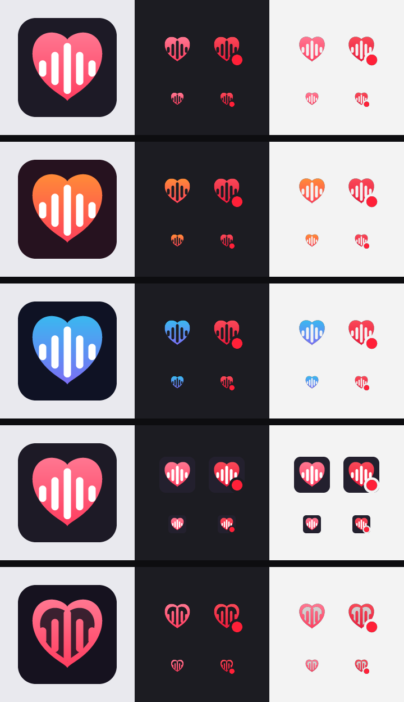

# Icon redesign proposals

The shipped tray glyph is a pale gray (`#e8e4f0`) heart that fades into the
taskbar, especially on Windows. These are five candidate redesigns that make
the icon more present, generated by `node scripts/gen-icon-proposals.js`.

Each preview sheet shows: the app icon (left), the tray icon on a dark
taskbar (middle) and on a light taskbar (right). Tray states are idle (left
column) and recording (right column, with a red dot badge), each at 64px and
at the native 32px.

| # | Variant | Idea |
| - | ------- | ---- |
| 1 | Coral | The app icon's coral gradient heart, brought to the tray as-is. |
| 2 | Ember | Warm amber-to-pink sunset gradient; unmissable on any taskbar. |
| 3 | Aurora | Violet-to-cyan gradient; a cooler, techy departure from coral. |
| 4 | Badge | The tray icon is a miniature of the app icon — dark rounded square with the coral heart. |
| 5 | Neon | Outlined heart with solid waveform bars — the wave becomes the hero. |



## Trying a variant locally

Copy its files over the shipped assets and start the app:

```sh
cp assets/proposals/1-coral/tray*.png assets/
cp assets/proposals/1-coral/icon.png assets/
npm start
```

(`git checkout -- assets` restores the originals.)

## After a variant is picked

Fold its palette into `scripts/gen-icons.js`, regenerate the shipped assets,
and delete `scripts/gen-icon-proposals.js`, `assets/proposals/`, and this
directory.
